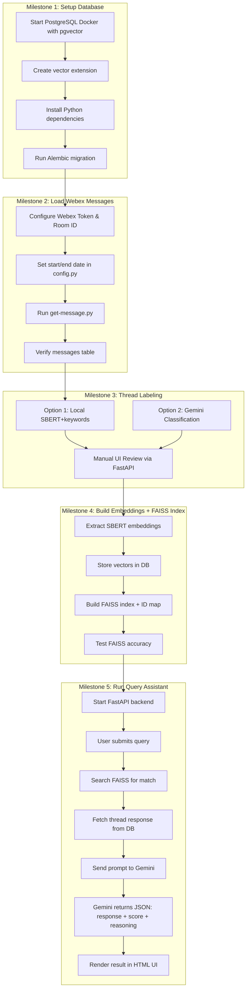
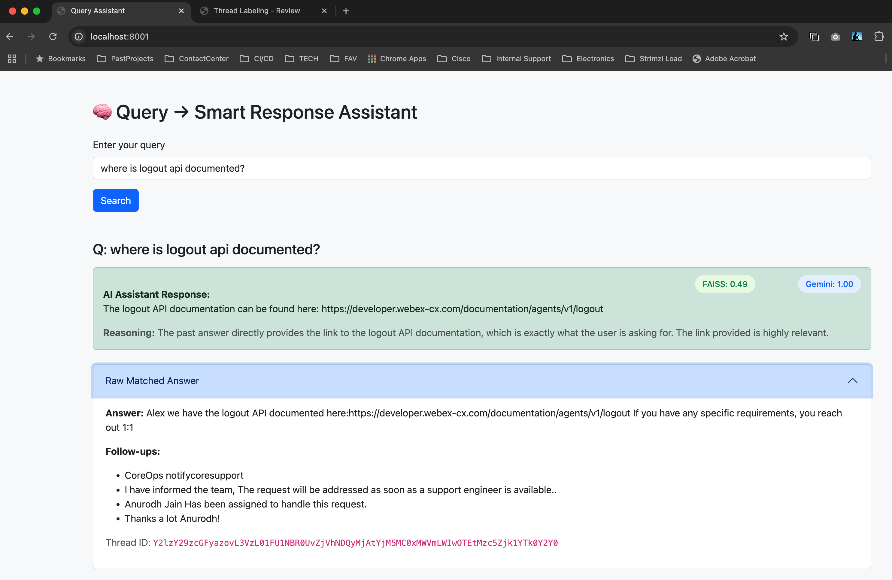

# 🤖 Webex AI Assistant

A smart assistant that helps analyze, label, and respond to queries posted in Webex Spaces using AI models like **SBERT**, **Gemini**, and **FAISS** for semantic search and classification.

---

## 🚀 Overview

This project demonstrates how to build an AI-powered assistant that helps engineers respond to technical queries posted in Webex Spaces. By leveraging historical conversations and AI-driven thread understanding, the assistant can automatically detect, classify, and retrieve relevant past answers to assist with new queries.

The core idea is to emulate the behavior of a knowledgeable support agent who has full context of previous discussions — surfacing solutions that were already shared in the past.

While the current implementation targets engineering discussions within Webex Spaces — which are often nuanced and context-rich — the approach is especially well-suited for domains like contact centers, where the types of queries and responses are more structured and repetitive. In such scenarios, the assistant can be highly effective in reducing response time and improving consistency by surfacing the most relevant prior solutions from a finite solution space.

### Key capabilities
- 📥 Ingestion of messages from Webex Spaces  
- 🧠 AI-based thread classification and solution detection  
- 📈 Embedding-based semantic search using FAISS  
- 📝 Gemini-powered contextual rephrasing of matched responses  
- 🌐 Interactive web frontend for querying and reviewing AI suggestions


---

### Project Workflow
Note: If you are viewing this in vscode, install the  **Markdown Preview Mermaid Support** extension if needed.



---

## 🧱 Project Structure

```plaintext
ai-assistant/
├── ai-thread-labeler/
│   ├── backend/                  # FastAPI backend with thread 
│   │   ├── models.py             # SQLAlchemy models
│   │   ├── main.py               # API server
│   │   └── classify_threads.py   # Gemini-based classifier
│   └── frontend/
│       └── thread_label_review   # Manual solution review 
│
├── embedding-service/
│   ├── extract_embeddings.py     # Convert messages to embeddings
│   ├── setup_faiss_index_and_idmap.py  # Build and persist FAISS index
│   └── verify_faiss_finetuned.py # Test similarity ranking
│
├── query-assistant/
│   ├── main.py                   # Gemini query handler and UI backend
│   ├── templates/index.html      # Query response UI
│   └── config.py                 # DB and model paths
│
├── webex_message_loader/
│   ├── get-message.py            # Pull messages from Webex API
│   ├── label-messages-be.py      # Legacy backend classifier
│   ├── label-messages-fe.py      # Frontend JSON output for manual 
│   └── config.py                 # Webex token and room ID setup
│
│
├── README.md
└── webex-ai-assistant-setup.md   # Full setup guide for local development
```

---

## 🔧 Technologies Used

- **FastAPI** - Backend server
- **PostgreSQL** with **pgvector** - Vector DB storage
- **FAISS** - Semantic similarity search
- **Google Gemini API** - Natural language processing + reasoning
- **SBERT** - Sentence-BERT embeddings
- **Bootstrap 5** - Web UI styling
- **Webex API** - Message ingestion

---

## 🛠 Setup Instructions

Follow the step-by-step guide in [`webex-ai-assistant-setup.md`](webex-ai-assistant-setup.md) to:

1. Spin up PostgreSQL with `pgvector` extension.
2. Ingest Webex messages.
3. Classify threads via Gemini or SBERT.
4. Build FAISS index.
5. Run backend and frontend servers.
6. Start querying past issues.

---

## 📸 UI Preview

 *(You can add your screenshot here)*

---

## ✅ Milestones

- ✅ Milestone 1: Setup database with vector support
- ✅ Milestone 2: Ingest and store messages
- ✅ Milestone 3: Classify threads and detect solutions
- ✅ Milestone 4: Build embeddings and FAISS index
- ✅ Milestone 5: Query assistant integration (UI + Gemini response)

---

## 📈 Improvements (Backlog / Future Work)

### 1. Better Query → Thread Matching (Multi-stage Retrieval)

**Problem:**  
Current FAISS retrieval is based purely on embedding similarity. It often returns threads that share surface-level terms but miss the true user intent (e.g., documentation queries returning troubleshooting answers).

**Planned Solution:**

| Step | Description |
|---|---|
| 1 | **FAISS Coarse Retrieval:** Fetch top 10–20 candidate threads based on vector similarity. |
| 2 | **LLM-based Re-ranking:** Use Gemini (or a lightweight local LLM) to re-rank the FAISS results by semantic relevance to the query. |
| 3 | **Intent Classification:** Add an intent detection step for the user query (e.g., "documentation", "how-to", "issue resolution"). Use this to filter or reweight candidate threads before Gemini prompting. |

---

### 2. Noise Filtering in Forum Messages (Child Message Cleanup)

**Problem:**  
Child messages in threads often contain operational noise like:

- Status updates:  
  _"I have informed the team"_, _"Assigned to engineer"_, _"Notified Core Support"_

- CC mentions:  
  _"cc: John Doe"_

**Planned Solution:**

| Type of Noise | Action |
|---|---|
| Name mentions / cc lines | Regex strip lines starting with `"cc:"` or detected personal names |
| Operational updates | Filter phrases like `"notified"`, `"assigned"`, `"ticket updated"` |
| Low-content posts | Filter very short messages that don't contain technical keywords |

---

### 3. Thread Intent-aware Answer Selection

**Problem:**  
Even if the right thread is retrieved, the backend may select an irrelevant child message (e.g., first answer tagged "answer" but unrelated to query intent).

**Planned Solution:**

| Current Behavior | Future Behavior |
|---|---|
| Selects first message labeled `"answer"` | Analyze all child messages and select the one **most aligned to user query intent**, using either embeddings or a small LLM. |

---

### 4. Intent-aware Gemini Prompting

**Current Fix:**  
Gemini prompt already contains query classification hints (e.g., if the query looks like a documentation request but the thread lacks links, Gemini is instructed to mark it as poor/no match).

**Future:**  
Integrate explicit intent detection for each user query. Pass intent type to Gemini and tailor the prompt accordingly.

---

### 5. Frontend UX Improvements

| Issue | Proposed Fix |
|---|---|
| No user feedback during backend processing | ✅ Added "Searching..." spinner. Can later replace with loading animation or progress bar. |
| Lack of visibility into FAISS / Gemini stages | Optional: Expose top FAISS threads and Gemini’s choice as an expandable developer/debugging view in the UI. |

---

### 6. Continuous Ingestion and Indexing Pipeline

**Problem:**  
Currently, all messages from the space are bulk-loaded once. Any new messages posted after that are not automatically ingested or indexed.

**Planned Solution:**

| Area | Action |
|---|---|
| Message Ingestion | Set up a scheduled job or webhook-based listener to monitor the space continuously for new posts. |
| Embedding Generation | Auto-generate embeddings for new messages on arrival. |
| FAISS Index Update | Incrementally update FAISS index to include new messages without needing a full rebuild. |
| Metadata Storage | Ensure new messages and their embeddings are persisted in the PostgreSQL and FAISS storage layers. |

---

### 7. Cloud Deployment & Hosting

**Problem:**  
The entire solution currently runs on a local development machine.

**Planned Solution:**

| Area | Action |
|---|---|
| Backend Hosting | Containerize the backend and deploy on a cloud VM or container service (e.g., AWS EC2, GCP GKE, Azure App Service). |
| Database Hosting | Move PostgreSQL to a managed cloud database service (e.g., AWS RDS, Cloud SQL). |
| FAISS Index Persistence | Host FAISS index files in durable cloud storage (e.g., S3, GCS) and load them at service startup. |
| Frontend Access | Expose the FastAPI app via a secure cloud endpoint with HTTPS (e.g., via NGINX, API Gateway, or similar). |
| CI/CD Pipeline | Optional: Set up CI/CD for auto-deployment on code changes. |

---

## 👥 Contributing

Contributions are welcome! Please file issues or feature requests in GitHub or reach out to the maintainers.

---

## 📝 License


---

## ✨ Authors

- [Prabhu] — Built and maintained this project with 💡 and ☕
